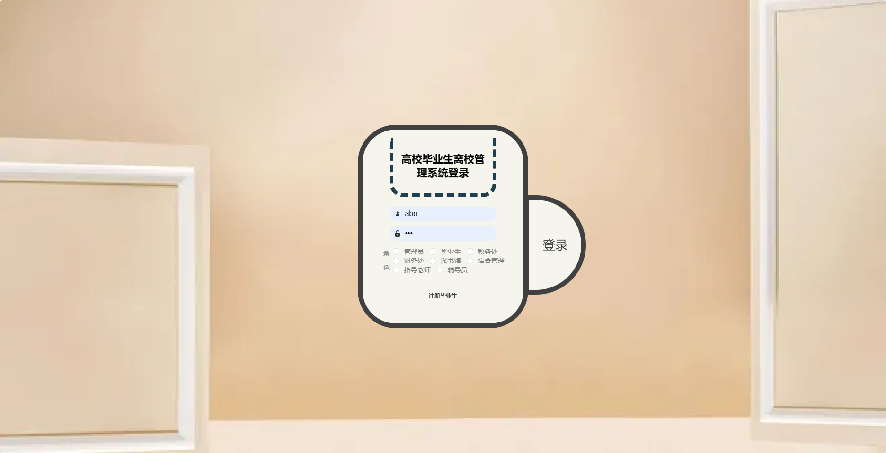
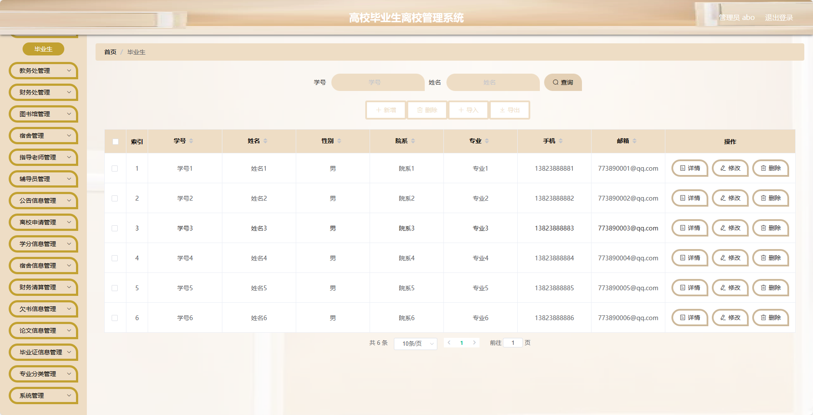
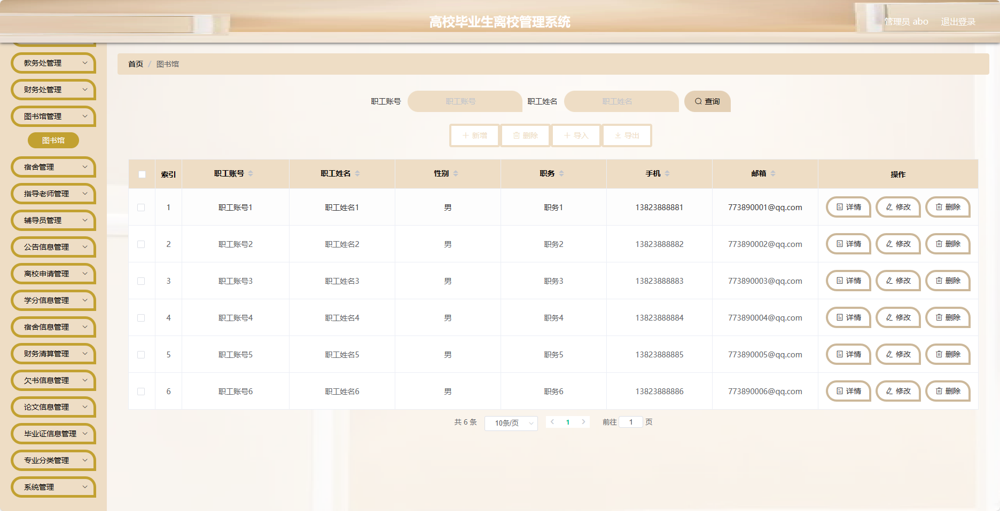
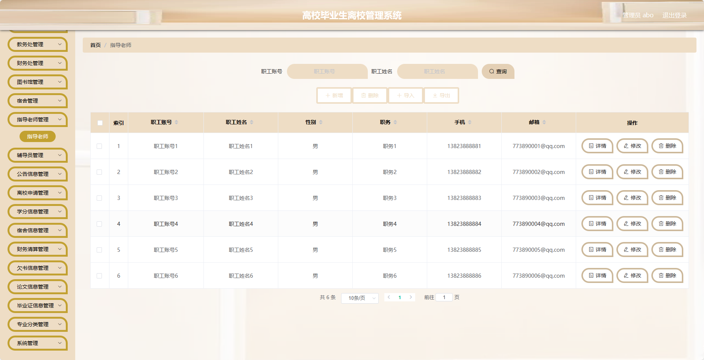
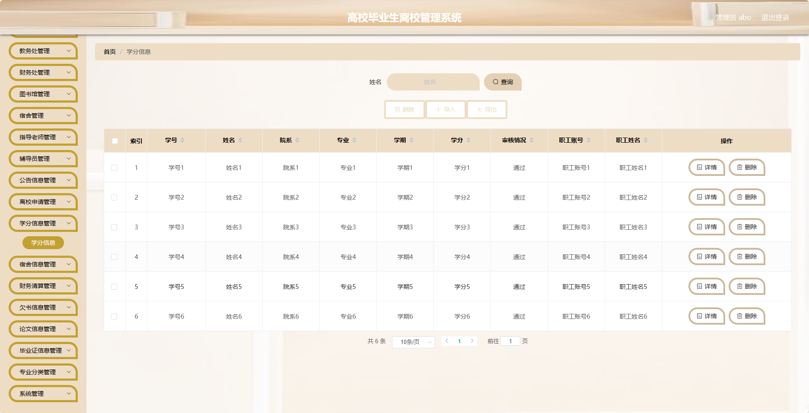
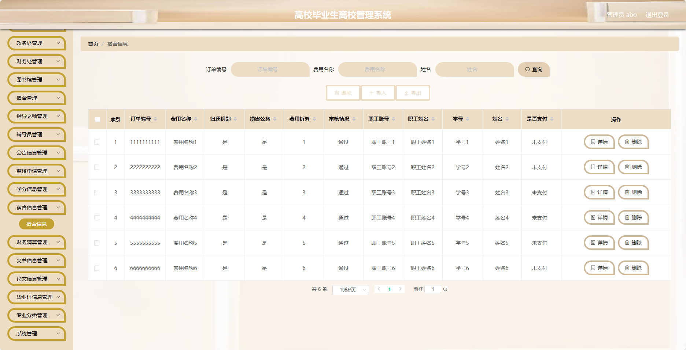
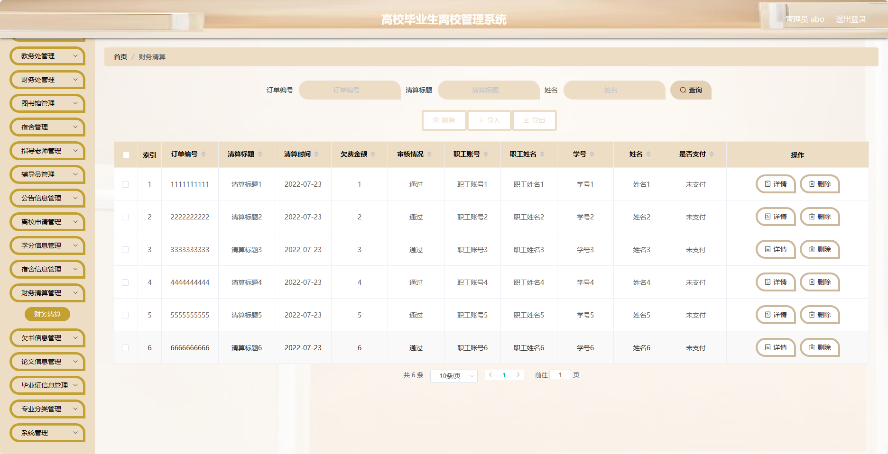
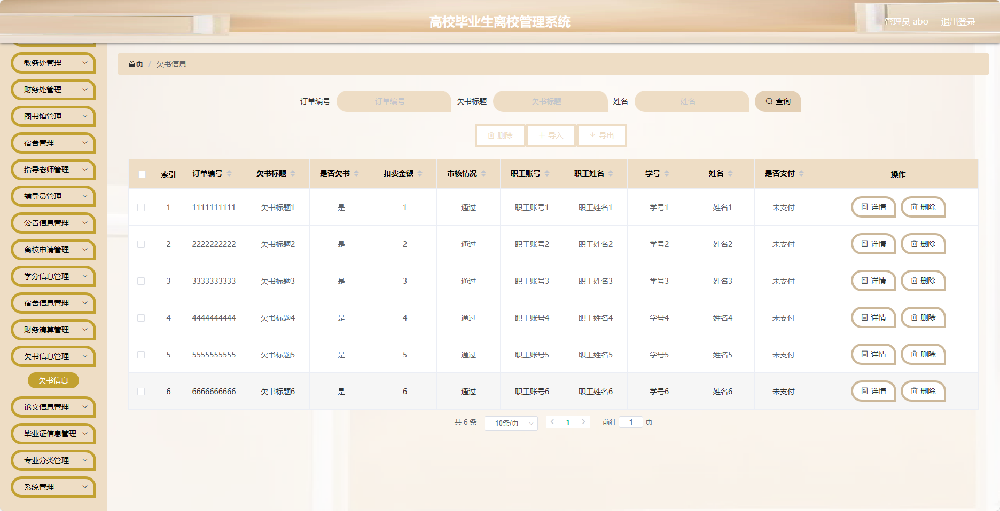
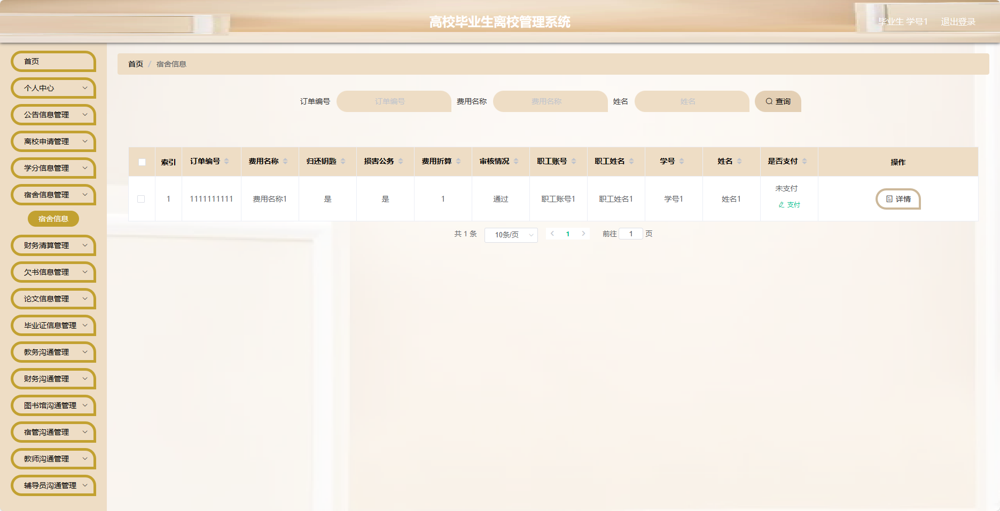
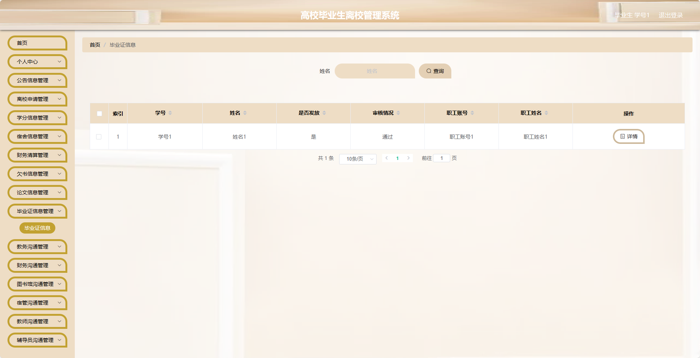

基于SpringBoot的高校毕业生离校管理系统
=
- 完整代码获取地址：从戎源码网 ([https://armycodes.com/](https://armycodes.com/))
- 作者微信：19941326836  QQ：952045282 
- 承接计算机毕业设计、Java毕业设计、Python毕业设计、深度学习、机器学习
- 选题+开题报告+任务书+程序定制+安装调试+论文+答辩ppt 一条龙服务
- 所有选题地址https://github.com/nature924/allProject

一、项目介绍
---
基于Spring Boot框架实现的高校毕业生离校管理系统，系统包含八种角色：管理员、财务处、指导老师、毕业生、图书馆、辅导员、教务处、宿舍管理,主要功能如下。
### 管理员：

1. 首页：展示系统的基础信息和操作入口。
2. 个人中心：管理员可以管理个人信息，包括修改密码等操作。
3. 毕业生管理：管理员可以管理毕业生的信息，包括添加、编辑、删除等操作。
4. 教务处管理：管理员可以管理教务处的信息，包括添加、编辑、删除等操作。
5. 财务处管理：管理员可以管理财务处的信息，包括添加、编辑、删除等操作。
6. 图书馆管理：管理员可以管理图书馆的信息，包括添加、编辑、删除等操作。
7. 宿舍管理：管理员可以管理宿舍的信息，包括添加、编辑、删除等操作。
8. 指导老师管理：管理员可以管理指导老师的信息，包括添加、编辑、删除等操作。
9. 辅导员管理：管理员可以管理辅导员的信息，包括添加、编辑、删除等操作。
10. 公告信息管理：管理员可以管理公告信息，包括添加、编辑、删除等操作。
11. 离校申请管理：管理员可以管理学生的离校申请，包括审批、驳回等操作。
12. 学分信息管理：管理员可以管理学分信息，包括添加、编辑、删除等操作。
13. 宿合信息管理：管理员可以管理宿合信息，包括添加、编辑、删除等操作。
14. 财务清算管理：管理员可以管理财务清算信息，包括添加、编辑、删除等操作。
15. 欠书信息管理：管理员可以管理欠书信息，包括添加、编辑、删除等操作。
16. 论文信息管理：管理员可以管理论文信息，包括添加、编辑、删除等操作。
17. 毕业证信息管理：管理员可以管理毕业证信息，包括添加、编辑、删除等操作。
18. 专业分类管理：管理员可以管理专业分类信息，包括添加、编辑、删除等操作。
19. 系统管理：管理员可以管理系统的基础数据和配置，包括用户信息、权限管理等。

### 学生：

1. 个人中心：学生可以管理个人信息，包括修改密码等操作。
2. 公告信息管理：学生可以查看和管理公告信息。
3. 离校申请管理：学生可以进行离校申请，包括填写申请信息等操作。
4. 学分信息管理：学生可以管理学分信息，包括查看和管理已修学分、未修学分等操作。
5. 宿合信息管理：学生可以管理宿合信息，包括查看宿舍信息、报修等操作。
6. 财务清算管理：学生可以管理财务清算信息，包括查看学费、缴费等操作。
7. 欠书信息管理：学生可以管理欠书信息，包括查看已借图书、还书等操作。
8. 论文信息管理：学生可以管理论文信息，包括上传、下载等操作。
9. 毕业证信息管理：学生可以管理毕业证信息，包括申请、查询等操作。
10. 教务沟通管理：学生可以向教务处发送沟通信息。
11. 财务沟通管理：学生可以向财务处发送沟通信息。
12. 图书馆沟通管理：学生可以向图书馆发送沟通信息。
13. 宿管沟通管理：学生可以向宿管发送沟通信息。
14. 教师沟通管理：学生可以向指导老师发送沟通信息。
15. 辅导员沟通管理：学生可以向辅导员发送沟通信息。

### 教务处：

1. 个人中心：教务处可以管理个人信息，包括修改密码等操作。
2. 公告信息管理：教务处可以管理公告信息，包括添加、编辑、删除等操作。
3. 离校申请管理：教务处可以审批学生的离校申请，包括通过、驳回等操作。
4. 学分信息管理：教务处可以管理学分信息，包括添加、编辑、删除等操作。
5. 教务沟通管理：教务处可以向学生发送沟通信息。

### 财务处：

1. 个人中心：财务处可以管理个人信息，包括修改密码等操作。
2. 公告信息管理：财务处可以管理公告信息，包括添加、编辑、删除等操作。
3. 财务清算管理：财务处可以管理财务清算信息，包括查看学费、缴费等操作。
4. 财务沟通管理：财务处可以向学生发送沟通信息。

### 图书馆：

1. 个人中心：图书馆可以管理个人信息，包括修改密码等操作。
2. 公告信息管理：图书馆可以管理公告信息，包括添加、编辑、删除等操作。
3. 欠书信息管理：图书馆可以管理欠书信息，包括添加、编辑、删除等操作。
4. 图书馆沟通管理：图书馆可以向学生发送沟通信息。

### 宿舍管理：

1. 个人中心：宿舍管理可以管理个人信息，包括修改密码等操作。
2. 公告信息管理：宿舍管理可以管理公告信息，包括添加、编辑、删除等操作。
3. 宿舍信息管理：宿舍管理可以管理宿舍信息，包括添加、编辑、删除等操作。
4. 宿管沟通管理：宿舍管理可以向学生发送沟通信息。

### 指导老师：

1. 个人中心：指导老师可以管理个人信息，包括修改密码等操作。
2. 公告信息管理：指导老师可以管理公告信息，包括添加、编辑、删除等操作。
3. 论文信息管理：指导老师可以管理论文信息，包括上传、下载等操作。
4. 教师沟通管理：指导老师可以向学生发送沟通信息。

### 辅导员：

1. 个人中心：辅导员可以管理个人信息，包括修改密码等操作。
2. 公告信息管理：辅导员可以管理公告信息，包括添加、编辑、删除等操作。
3. 毕业证信息管理：辅导员可以管理毕业证信息，包括申请、查询等操作。
4. 辅导员沟通管理：辅导员可以向学生发送沟通信息。

二、项目技术
---
- 编程语言：Java
- 数据库：MySQL
- 项目管理工具：Maven
- 前端技术：VUE、HTML、Jquery、Bootstrap
- 后端技术：Spring、SpringMVC、MyBatis

三、运行环境
---
- 操作系统：Windows、macOS都可以
- JDK版本：JDK1.8以上都可以
- 开发工具：IDEA、Ecplise、Myecplise都可以
- 数据库: MySQL5.7以上都可以
- Tomcat：任意版本都可以
- Maven：任意版本都可以

四、运行截图
---

### 程序截图：

